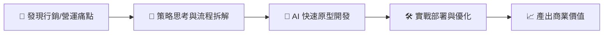

# 👋 哈囉，我是 Toyo Chang | 行銷科技與數位轉型策略師
> **🚀 致力於透過 AI 技術實現「行銷自動化」與「數位轉型」的實踐者**

## 🎯 我的定位
我不是純粹的軟體工程師，而是一位**「懂技術的行銷策略家」**。我專注於如何利用 AI 與數位工具，將繁瑣的營運流程自動化，並透過數據洞察為企業創造實質的行銷轉換與商業產值。

*   🔭 **核心使命**：縮短「行銷創意」與「技術實現」之間的距離。
*   🤝 **跨部門翻譯官**：擅長擔任「行銷思維」與「工程語言」間的橋樑，確保技術開發精準對齊商業目標。
*   🚀 **核心實力**：行銷科技系統建置、AI 協作開發、跨界導流策略、營運自動化。
*   🎯 **目標**：用技術賦能行銷，將數位工具轉化為企業的營收成長引擎。

## 🎮 我的開發哲學

對我來說，寫 code 從來就不像在工作——更像是在玩一款 **Build 類型的遊戲**。這類遊戲的核心不是單純蓋東西，而是設計環環相扣的系統：每個模組如何銜接、資源怎麼在流程中流動、瓶頸出現在哪裡、怎麼優化到整條線全速運轉。那種「系統終於完美咬合」的瞬間，是我最享受的爽感。

而 AI 的出現，讓這場遊戲變得更過癮：它是最強的「自動化模組」，讓我能把精力全壓在真正燒腦的事——**架構設計、邏輯拆解、系統優化**。

## 🧰 我的 AI 開發工具箱

熟練運用多款專業級 AI 開發工具以優化工作流程：
*   **Claude Code (CLI) Pro** | **GPT Codex (IDE) Plus** | **Google Antigravity (IDE) Pro**

---

## 🧠 我的策略思維流程

> **「在 AI 時代，技術不再是門檻，而是讓創意得以極致展現的最強大引擎。」**

## 📊 數位轉型戰績看板
| 🚀 開發加速 | ⏱️ 年度省時 | 📉 營運摩擦 | 🎪 成功案例 |
| :---: | :---: | :---: | :---: |
| [**300%+**](https://github.com/s110905/jojozoo-portfolio/blob/master/PROMPTS.md#量化效能提升) | [**400+ 小時**](https://github.com/s110905/jojozoo-portfolio) | [**降低 40%**](https://github.com/s110905/jojozoo-portfolio/tree/master/01-summer-camp) | [**7+ 專案**](#🏆-精選-行銷科技成功案例) |
> *數據基於 Git Velocity 實測與營運效率評估，證明 AI 協作開發的實質產值。*

---

## 🌟 專業作品集總覽
強烈建議您前往查看我精心整理的完整專案作品集，內含詳細的 **商業痛點分析**、**系統架構圖** 與 **AI 協作實錄**：

👉 **[點此進入我的專案作品集 (jojozoo-portfolio)](https://github.com/s110905/jojozoo-portfolio)**

---

## 🏆 精選 行銷科技成功案例

### 🎪 2026 夏令營一站式自動化報名系統
👉 **[查看專案詳情與案例分析](https://github.com/s110905/jojozoo-portfolio/tree/master/01-summer-camp)** | 🌐 **[線上展示 (Live Demo)](https://www.jojozoopark.com/camp/)**
*實現「報名到對帳全流程同頁完成」的極簡體驗，有效提升轉換率並節省 **100+ 小時** 行政成本。*

### 💳 飯店合作夥伴：數位核銷與 B2B 對帳系統
👉 **[查看專案詳情與案例分析](https://github.com/s110905/jojozoo-portfolio/tree/master/03-hotel-partner-system)** | 🌐 **[線上展示](https://www.jojozoopark.com/hpes/)**
> 🔑 **測試帳號**：`demo` | **測試密碼**：`demo`
*透過數位 QR 碼與即時餘額管理，解決 B2B 合作間的對帳爭議並提升導客體驗。*

### 🎟️ 廣三 SOGO X 九九峰：O2O 跨界領券系統
👉 **[查看專案詳情與案例分析](https://github.com/s110905/jojozoo-portfolio/tree/master/07-kuangsan-collaboration)** | 🌐 **[線上展示](https://www.jojozoopark.com/kuangsan-ticket/)**
*異業結盟實踐，透過數位化領券流程精確追蹤百貨客群到樂園的「轉換率」。*

### 🕷️ ERP Spider: 企業營收數據自動整合
👉 **[查看專案詳情與案例分析](https://github.com/s110905/jojozoo-portfolio/tree/master/06-erp-automation-spider)**
*數位轉型基石，將跨平台的「數據孤島」自動整合為即時決策報表，年度節省 **200+ 小時** 人力。*

---
**歡迎與我聯絡：**
*   Email: [s110905toyo@gmail.com](mailto:s110905toyo@gmail.com)
